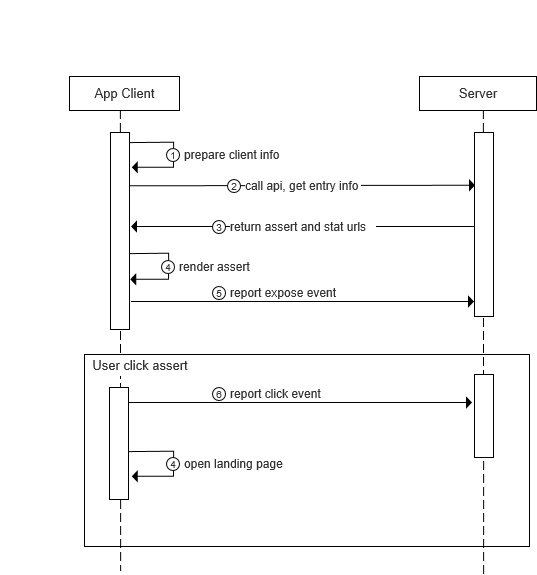

#  Adfly interactive ad api request for comments


## Api overview




### 1. Prepare client info


| Name         | Type   | Description                                          | Required | example |
|--------------|--------|------------------------------------------------------|----------|-------------------------------------------------------------------------------------------------|
| idfa         | string | iOS required                                         | Yes      |
| widgetId     | string |  widget id, get from our dashboard, string(int)  | Yes | 851 |
| advertiserId | string | Android required <br/> Get by AdvertisingIdClient\.getAdvertisingIdInfo\(\) | Yes | d66c3793\-10c1\-48f1\-81bd\-d8f3e6e33d92|
| longitude    | string | GPS longitude                                        | No | 118\.78|
| latitude     | string | GPS latitude                                         | No | 32\.04|
| os           | string | Operate system name and version                      | No | ios\_11\.3, android\_6\.0\.1|
| language     | string | Operate system language                      | No | english |
| network      | string | Network type: wifi/3G/4G/2G                          | No | wifi, 2G, 3G, 4G |
| apps         | string | Installed package list\.Package names splited by ‘,’ | No | com\.ss\.android\. ugc\.live,cn\.v6\.si xrooms,com\.zt game\.bob,com\. nd\.android\.pan dahome2 |

> Apps shouldn’t include system package name, it can be filtered by code:
> ```java
> (app.flags & ApplicationInfo.FLAG_SYSTEM)<=0)
> ```

We get client info, and format it into json. Then compress it by gzip. At last encode it by base64.

```
ci = base64(gzip(json))
```

### 2. Build request

|                | field           | type   | note                           |
|----------------|-----------------|--|--|
| Request param  |
| appKey          | String |                                |
| soltId          | Long | Identify different ad slots, defined by publisher |
| ci              | String | get by prepare client info     |
| timestamp       | Long   | System\.currentTimeMillis\(\)  |
| nonce           | String |    A random string, 6 bytes    |
| deviceId        | String | Andriod： adverserId, iOS: idfs |
| signature       | String | signature calc by sha1 |
| Response param |
| code    | int          |  |
| message    | String          |  |
| landing      | String | landing page url |
| widgetTracker | specified struct | widget(placement) show&click&close tracking info |
| widgetTracker.impl | String | widget(placement) show tracking url |
| widgetTracker.click | String | widget(placement) click tracking url |
| widgetTracker.close | String | widget(placement) close tracking url |
| widgetTracker.UserIp | String | ignore it |
| assertInterval | String | show assert in assertList interval(seconds) |
| assertList  | specified struct list | assert list |
| assertList[n].assertId  | String | assert list |
| assertList[n].img  | String | assert img to show |
| assertList[n].tracker  | pecified struct | assert show&click&close tracking info |
| assertList[n].tracker.impl  | string | assert show tracking url |
| assertList[n].tracker.click  | string | assert click tracking url |
| assertList[n].tracker.close  | string | ignore it |
| assertList[n].window  | pecified struct | ignore it |

* note:
1. When the assert is displayed for the first time with the same request, report the widget(placement) show event by widgetTracker.impl;
2. when click on the assert at any time, report the widget(placement) click event by  widgetTracker.click;
3. when close placement at any time, report the widget(placement) close event by  widgetTracker.close;
4. The style collection of assert. Loop display every assertInterval seconds;
5. Only make the report display request (by assertList[n].tracker.impl) in the first Loop display;
6. when display the assert in the second loop, do not report the display request; 
7. when clicked one assert, report the click tracking (by assertList[n].tracker.click).

#### Generate signature

For api safety, signature is required. We use sha1 calc summary for appKey, appSecret, ci, device_id, nonce, timestamp. And set signature in url query params.

1. Build string as   
    ```appKey={appKey},appSecret={appSecret},ci={ci},deviceId={deviceId},nonce={nonce},soltId={soltId},timestamp={timestamp}```
2. Use sha1 calc signature

    ```
    signature = sha1.sum(data)
    ```

#### Do request

1. Build request url: 

    ```
    https://api.flygame.io/api/ig/entry/query/v2?appKey=appkey&ci=urlencode(ci)&deviceId=urlencode(deviceId)&nonce=urlencode(nonce)&soltId=soltId&timestamp=timestamp&signature=signature
    ```
2. Send http request use any get or post method


**Note:**

1. The appKey and appSecret is generate 
2. At laster url must not contains appSecret

## Tools

For calc signature is easy to mistake. There comes a signature checker: https://api.flygame.io/devtools/sign 

## Examples

<!-- - [Android](./demo/android) -->
- [Javascript](./demo/js_demo_v2.js)
<!-- - [iOS](./demo/ios) -->

## request eg:
```
 curl "https://api.flygame.io/api/ig/entry/query/v2?appKey=2048-match+to+win&ci=H4sIAAAAAAAA%2F0yO0YqDMBRE%2F2WeE%2FFuFtfkD%2FYrlqz3GkJLIjFqoPTfi9KHvgycGRjOA553KTWuUn4ZDjwMk%2FmxRlM%2Fkf4eZ9Ij%2FbPmcTYyiDFsv6Dgl2WFQ2tNtdbojLOOPHs4QOHuU9h8EDjs8eIa68byXnMKH5ikHrnc4NBDIZ%2FPPnHJkf%2Boo46gcEQOUi9Fa3s8XwAAAP%2F%2FAQAA%2F%2F9IThX%2FuQAAAA%3D%3D&deviceId=&nonce=XVlBzg&signature=72cfcbed00ac142b38841f948693e31400296864&soltId=1&timestamp=1625565975121" | jq .
```

## response body eg

```json
{
  "code": 0,
  "message": "",
  "landing": "https://game.flygame.io/tha_qa/index.html?bx_third_client=2048-match to win&uid=&v=1.1.11&req_id=8da77ec1-7747-432c-a85c-b2a8495a3fd2&assert=&pid=25&theme=2&showMore=1&wid=990&inner=0&country=th&ad",
  "widgetTracker": {
    "impl": "https://api.flygame.io/api/ig/widget/stat?gameType=tha_qa&platform=android&appKey=sys&partner=2048-match+to+win&wid=990&assertId=0&entry_alg=&landing_alg=ctr_top5_rand&country=th&widgetId=990&timest2a8495a3fd2&deviceId=&nonce=396576182&signature=2e9eeca2ab88409e63bf27f45d9f9f6802458fa0",
    "click": "https://api.flygame.io/api/ig/widget/stat?timestamp=1625566077257&action=3&landing_alg=ctr_top5_rand&gameType=tha_qa&deviceId=&nonce=1361858605&platform=android&partner=2048-match+to+win&assertId=0ntry=th&entry_alg=&widgetId=990&wid=990&signature=768ddfad47b33aebc45eb612be59d80838e71ce4",
    "close": "https://api.flygame.io/api/ig/widget/stat?timestamp=1625566077257&wid=990&partner=2048-match+to+win&gameType=tha_qa&platform=android&appKey=sys&nonce=789402386&assertId=0&entry_alg=&landing_alg=ctrtry=th&deviceId=&action=5&widgetId=990&signature=ab18bfb3ea08dbf6e11d7910c1dbc2528e096c0b",
    "UserIp": "127.0.0.1"
  },
  "assertInterval": 10,
  "assertList": [
    {
      "assertId": "24020",
      "img": "https://image2.vnay.vn/topnews-2017/imgs/2b/0a/2b0aad173b425b5c99ed600d19882caa.gif",
      "tracker": {
        "impl": "https://api.flygame.io/api/ig/widget/stat?action=2&platform=android&timestamp=1625566077255&assertId=24020&req_id=8da77ec1-7747-432c-a85c-b2a8495a3fd2&gameType=&landing_alg=&country=th&widgetId=in&wid=990&deviceId=&nonce=1226493728&signature=5aa2fda3a76d7cecb0158cb6cabc03dc28573090",
        "click": "https://api.flygame.io/api/ig/widget/stat?jas=1&assertId=24020&platform=android&widgetId=990&appKey=sys&country=th&req_id=8da77ec1-7747-432c-a85c-b2a8495a3fd2&landing_alg=&partner=2048-match+toon=3&entry_alg=stat&gameType=&wid=990&signature=a4eb2369c4e4664f77c6d49e062723ab7a5cc957",
        "close": "https://api.flygame.io/api/ig/widget/stat?jas=1&action=5&partner=2048-match+to+win&country=th&req_id=8da77ec1-7747-432c-a85c-b2a8495a3fd2&widgetId=990&landing_alg=&nonce=1186184854&timestamp=16oid&gameType=&assertId=24020&deviceId=&signature=477982346e78139c6fcc953d1175cac7cceb82e6",
        "UserIp": "127.0.0.1"
      },
      "window": {
        "right": "",
        "bottom": "",
        "width": "",
        "height": ""
      }
    },
    {
      "assertId": "24023",
      "img": "https://image2.vnay.vn/topnews-2017/imgs/76/fb/76fb62b1a12852bcd0bb1ace103e371f.gif",
      "tracker": {
        "impl": "https://api.flygame.io/api/ig/widget/stat?entry_alg=stat&country=th&req_id=8da77ec1-7747-432c-a85c-b2a8495a3fd2&landing_alg=&deviceId=&appKey=sys&widgetId=990&action=2&jas=1&assertId=24023&wid=9ch+to+win&gameType=&platform=android&signature=56504c813e9cae890192c1a033143b81e9ef5ba4",
        "click": "https://api.flygame.io/api/ig/widget/stat?nonce=144092779&req_id=8da77ec1-7747-432c-a85c-b2a8495a3fd2&landing_alg=&gameType=&entry_alg=stat&deviceId=&appKey=sys&wid=990&assertId=24023&partner=2m=android&jas=1&widgetId=990&action=3&signature=e55843f543623763ca992a316406b255ac5f3518",
        "close": "https://api.flygame.io/api/ig/widget/stat?deviceId=&req_id=8da77ec1-7747-432c-a85c-b2a8495a3fd2&landing_alg=&nonce=1120867411&timestamp=1625566077256&wid=990&jas=1&appKey=sys&action=5&entry_algsertId=24023&partner=2048-match+to+win&signature=5142eeb9b96dd41164fdc3786fb38007ec56c820",
        "UserIp": "127.0.0.1"
      },
      "window": {
        "right": "",
        "bottom": "",
        "width": "",
        "height": ""
      }
    },
    {
      "assertId": "24015",
      "img": "https://image2.vnay.vn/topnews-2017/imgs/32/bc/32bc28f23cc806d6d030a43e3a3c277e.png",
      "tracker": {
        "impl": "https://api.flygame.io/api/ig/widget/stat?partner=2048-match+to+win&assertId=24015&widgetId=990&landing_alg=&appKey=sys&nonce=1258017573&wid=990&gameType=&deviceId=&entry_alg=stat&platform=androd2&country=th&timestamp=1625566077256&signature=4a86f32a9f83e92e46578ca79a9f5f2c8f9ef1a6",
        "click": "https://api.flygame.io/api/ig/widget/stat?platform=android&widgetId=990&timestamp=1625566077256&gameType=&wid=990&landing_alg=&partner=2048-match+to+win&appKey=sys&req_id=8da77ec1-7747-432c-a853&assertId=24015&country=th&deviceId=&signature=04c7fa18ffed8d8782369eeac70baa43ae9fbd1d",
        "close": "https://api.flygame.io/api/ig/widget/stat?nonce=1044438655&landing_alg=&jas=1&partner=2048-match+to+win&deviceId=&platform=android&action=5&gameType=&entry_alg=stat&country=th&req_id=8da77ec1-7=24015&wid=990&widgetId=990&appKey=sys&signature=85363cf4ebe9046044808315045d526b4b049ce5",
        "UserIp": "127.0.0.1"
      },
      "window": {
        "right": "",
        "bottom": "",
        "width": "",
        "height": ""
      }
    },
    {
      "assertId": "24009",
      "img": "https://image2.vnay.vn/topnews-2017/imgs/81/36/8136552f2f6e15400acbdd23ffcaf61d.gif",
      "tracker": {
        "impl": "https://api.flygame.io/api/ig/widget/stat?appKey=sys&action=2&req_id=8da77ec1-7747-432c-a85c-b2a8495a3fd2&jas=1&landing_alg=&platform=android&country=th&deviceId=&widgetId=990&entry_alg=stat&wid=197703718&partner=2048-match+to+win&signature=07658b8545e9e264d8ddcb40cf648a28c1721214",
        "click": "https://api.flygame.io/api/ig/widget/stat?entry_alg=stat&wid=990&jas=1&action=3&assertId=24009&country=th&widgetId=990&timestamp=1625566077256&landing_alg=&gameType=&req_id=8da77ec1-7747-432c-a+win&nonce=741955724&platform=android&signature=c3000392264c9dbd80c353898f3b63a03a170fa0",
        "close": "https://api.flygame.io/api/ig/widget/stat?deviceId=&appKey=sys&partner=2048-match+to+win&landing_alg=&assertId=24009&entry_alg=stat&country=th&widgetId=990&nonce=1955314508&action=5&jas=1&platfd=8da77ec1-7747-432c-a85c-b2a8495a3fd2&signature=0264f38105fef3c5fee5de21aed02f0b97a80577",
        "UserIp": "127.0.0.1"
      },
      "window": {
        "right": "",
        "bottom": "",
        "width": "",
        "height": ""
      }
    },
    {
      "assertId": "24013",
      "img": "https://image2.vnay.vn/topnews-2017/imgs/e7/ea/e7ea2aaa811036ee458b85d1f13f9f62.png",
      "tracker": {
        "impl": "https://api.flygame.io/api/ig/widget/stat?appKey=sys&nonce=1367422917&country=th&landing_alg=&req_id=8da77ec1-7747-432c-a85c-b2a8495a3fd2&jas=1&partner=2048-match+to+win&platform=android&action=tId=24013&entry_alg=stat&widgetId=990&signature=78b26472e3cd1ed3456b7f8f7b7aca7ec69a47a6",
        "click": "https://api.flygame.io/api/ig/widget/stat?landing_alg=&entry_alg=stat&country=th&platform=android&appKey=sys&timestamp=1625566077256&deviceId=&req_id=8da77ec1-7747-432c-a85c-b2a8495a3fd2&gameTyner=2048-match+to+win&wid=990&action=3&signature=43825c73545f34122159ff6a593747851e03353f",
        "close": "https://api.flygame.io/api/ig/widget/stat?appKey=sys&gameType=&entry_alg=stat&req_id=8da77ec1-7747-432c-a85c-b2a8495a3fd2&wid=990&timestamp=1625566077256&action=5&landing_alg=&assertId=24013&de8-match+to+win&country=th&widgetId=990&signature=a2a08bc9ce35e0812c461e717fe2a37865e11842",
        "UserIp": "127.0.0.1"
      },
      "window": {
        "right": "",
        "bottom": "",
        "width": "",
        "height": ""
      }
    }
  ]
}

```
